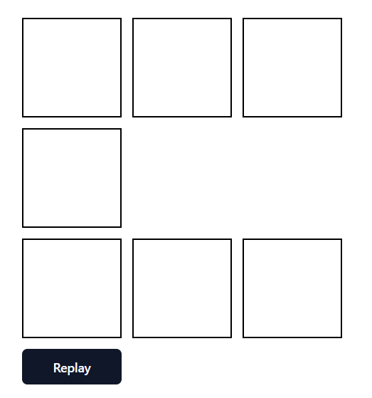

# Color-Box


## Tasks
- There’re 7 boxes in the page and each box can be toggled (white/green) by mouse click.
- If all the boxes are filled as green, then automatically remove green color from boxes one by one in reversed order every 500 ms.
- All mouse click events on boxes should be disabled during this auto process.
- If user clicks outside of 7 boxes on the page, then stop the above automatic process.
- If user clicks “Replay” button on the page, then play all the history from scratch in 300ms period.
- Needs to save history in the backend.
- While replaying, “Replay” button should be disabled and all the mouse click events should also be disabled.

## Environment
- Windows 11
- Node v20.15.1
- Npm 10.7.0

## Tech stacks
- Vite + React + Typescript
- Express
- Radix UI
- Tailwind CSS
- Shadcn UI
- React Query

## Steps to run program
1. Install node modules
   ```shell
   npm install
   ```

2. Run project
   ```shell
   npm run dev
   ```
This will host the project on http://localhost:3000.
